# Project Setup Guide

## Prerequisites
Ensure you have the following installed and configured before proceeding:
- AWS CLI
- Terraform
- Git

## Steps to Set Up the Project

### Step 1: Clone the Repository
```sh
 git clone https://github.com/prabhat-roy/particle41.git
```

### Step 2: Create an AWS IAM User
- Create a user in the AWS IAM console.
- Assign `AdministratorAccess` policy.
- Generate and store the credentials securely.

### Step 3: Install AWS CLI and Terraform
Ensure AWS CLI and Terraform are installed on your system.

### Step 4: Configure AWS Credentials
```sh
 aws configure
```
Provide the credentials generated in Step 2.

### Step 5: Configure Terraform Variables
Navigate to the Terraform directory and modify the values in `terraform.tfvars` as needed.

### Step 6: Initialize Terraform
```sh
 terraform init
```

### Step 7: Validate Terraform Configuration
```sh
 terraform validate
```

### Step 8: Generate a Terraform Execution Plan
```sh
 terraform plan
```

### Step 9: Apply Terraform Configuration
```sh
 terraform apply -auto-approve
```

### Step 10: Retrieve Jenkins Admin Password
Copy the admin password from the last line of the Terraform output.

### Step 11: Access Jenkins and SonarQube
Visit the URL provided in the Terraform output to log into Jenkins and SonarQube.

### Step 12: Configure Jenkins
- Log into Jenkins using the admin password.
- Create three pipelines:
   Kubernetes Cluster Creation and Deletion, Application Deployment and Resource Deletion in Kubernetes

### Step 13: Configure SonarQube
- Log into SonarQube with `admin/admin` and change the password.
- Generate a credential to use in Jenkins.
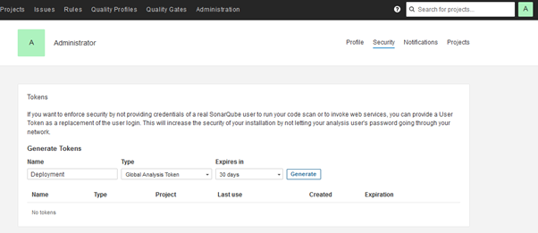

### Step 14: Install and Configure SonarQube Plugin in Jenkins
- Go to **Manage Jenkins → Plugins** and install the SonarQube plugin.
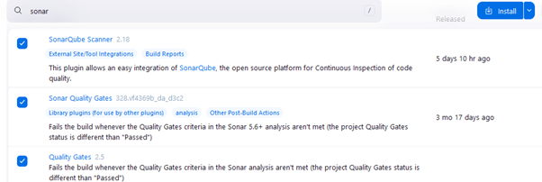
- Navigate to **Manage Jenkins → Credentials** and add a **Secret Text** credential using the SonarQube token.
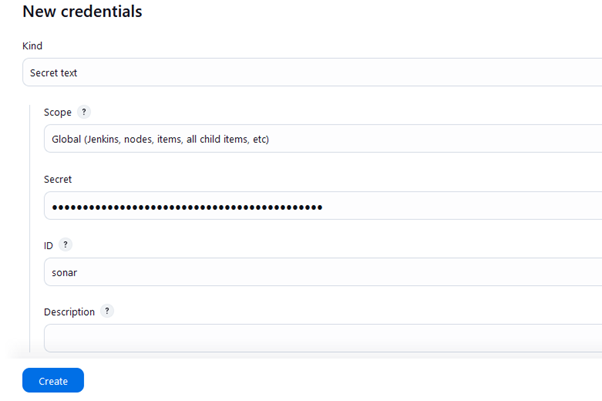
- Go to **Manage Jenkins → System**, configure SonarQube with IP `127.0.0.1`, and select the credential.
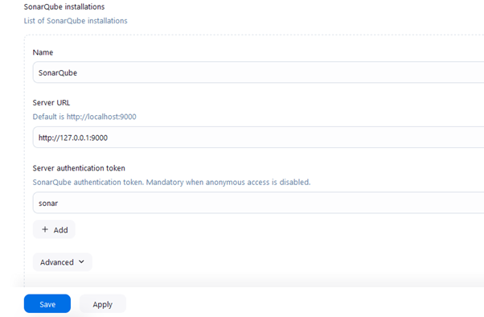
- Install SonarQube Scanner from **Manage Jenkins → Tools**.
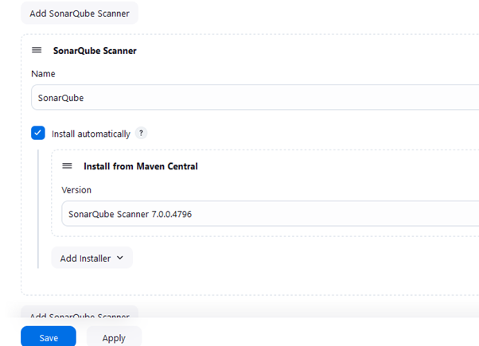

### Step 15: Create Kubernetes Cluster Pipeline in Jenkins
- From the Jenkins dashboard, create a **New Item**.
- Select **Pipeline** and provide a name.
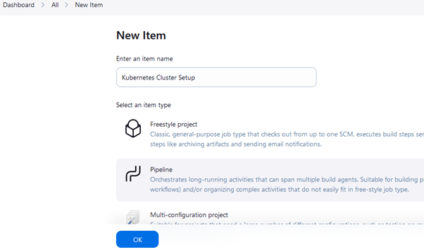
- Enable "This project is parameterized" and add a **Choice Parameter**.
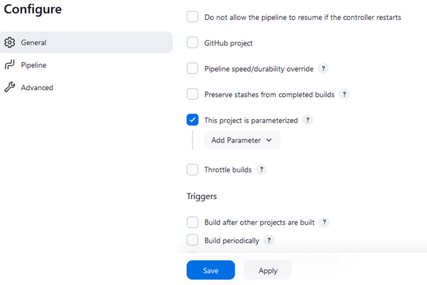
- Select Choice parameter from the dropdown
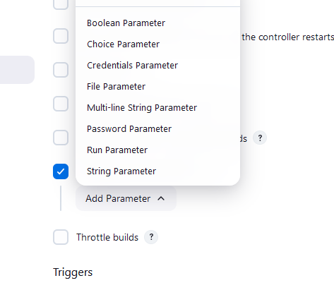
- Provide the name and choices
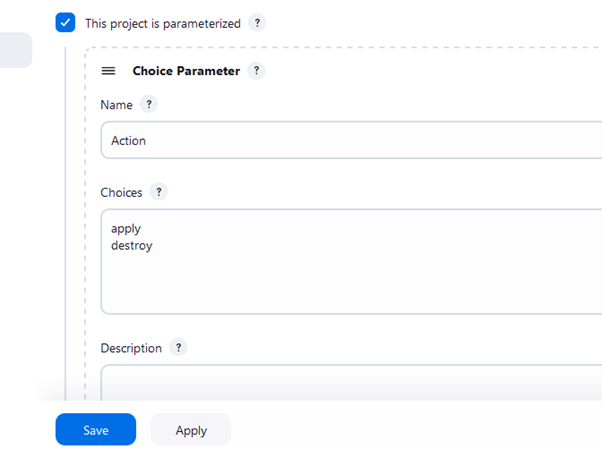
- Set the pipeline definition to "Pipeline script from SCM" with the following:
  - **SCM URL**: `https://github.com/prabhat-roy/particle41.git`
  - **Branch**: `main`
  - **Script Path**: `Jenkinsfile_Kubernetes_Cluster`
 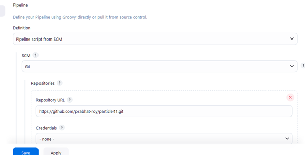 
- Click **Build with Parameters**, choose "apply action," and run the pipeline. This process takes around 15–20 minutes.
 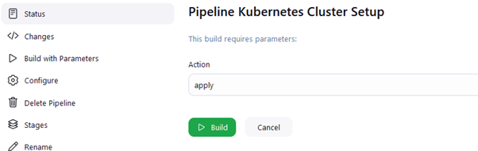 
### Step 16: Create Application Deployment Pipeline
- Create another pipeline with **Script Path**: `Jenkinsfile_Kubernetes_Deployment`.
- Run the pipeline to deploy the application.
 
### Step 17: Create Kubernetes Resource Deletion Pipeline
- Create another pipeline with **Script Path**: `Jenkinsfile_Kubernetes_Resource_Delete`.
- Run this pipeline to delete Kubernetes resources.

### Step 18: Verify Deployment
- Copy the **Load Balancer URL** (from Step 16) and open it in a browser to check the application.
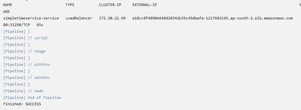
- Navigate to SonarQube to verify code quality status.
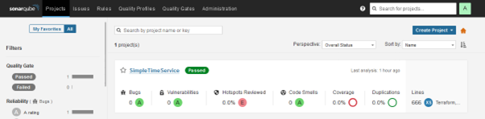
---
